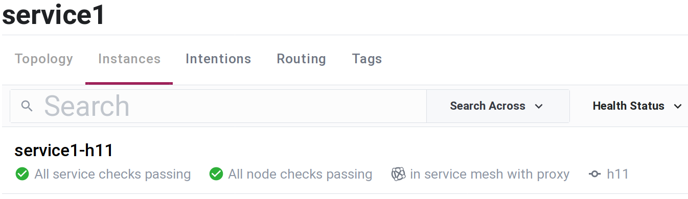

# MeshxConsul
[](https://hex.pm/packages/meshx_consul)
[](https://hexdocs.pm/meshx_consul)

<!-- MDOC !-->
Consul service mesh adapter.

`MeshxConsul` is a service mesh adapter implementing [`Meshx.ServiceMesh`](https://github.com/andrzej-mag/meshx/blob/master/lib/meshx_service_mesh.ex) behaviour using HashiCorp [Consul](https://www.consul.io/) as an external service mesh application.

Primary package objectives are to prepare:
  * mesh service endpoints used to start user service providers,
  * mesh upstream endpoints used to connect user upstream clients.

Features:
  * TTL health check workers for mesh services,
  * management of long running proxy binary commands used by service mesh data plane,
  * automatic TCP address generation for mesh service and upstream endpoints.

`MeshxConsul` primary purpose is to be used with other `Meshx` packages: `MeshxRpc` and `MeshxNode`. Package can also be used with any other user client/server application running on top of TCP protocol. UDP is not supported.

`MeshxConsul` using service mesh software (Consul) backed up by proxy application (e.g. Envoy) will enhance user application with features characteristic to mesh environment, especially: mTLS traffic encryption, service ACLs, proxy traffic management features, possibly load balancing and high availability and others. Please refer to [Consul documentation](https://www.consul.io/docs) for additional details.

## Requirements
`MeshxConsul` requires access to Consul agent ([installation instructions](https://www.consul.io/docs/install)). Additionally proxy application supported by Consul to run service mesh data plane is needed. Mainstream proxies supported by Consul: Consul built-in [Connect Proxy](https://www.consul.io/docs/connect/proxies/built-in), [Envoy Proxy](https://www.envoyproxy.io/), [HAProxy](https://github.com/haproxytech/haproxy-consul-connect).

## Installation
Add `:meshx_consul` to application dependencies:
```elixir
# mix.exs
def deps do
  [{:meshx_consul, "~> 0.1.0-dev", github: "andrzej-mag/meshx_consul"}]
end
```

## Usage
Before using `MeshxConsul`, Consul agent http(s) API endpoint address and authorization token must be configured.
Example config for Consul agent running on the same host as user application and http API attached to unix domain socket at path `"/run/consul/http.sock"` with empty Consul authentication token:
```elixir
# config/config.exs
import Config
config :meshx_consul,
  cli_env: [
    {"CONSUL_HTTP_ADDR", "unix:///run/consul/http.sock"},
    {"CONSUL_HTTP_TOKEN", ""}
  ],
  httpc_opts: [
    ipfamily: :local,
    unix_socket: '/run/consul/http.sock'
  ],
  httpc_headers: [{'X-Consul-Token', ''}]
```
Consul token must be associated with sufficient Consul ACL privileges to create and delete services on given Consul agent instance. Example Consul agent config compatible with configuration above: [example/example_config_consul.hcl](https://github.com/andrzej-mag/meshx_consul/blob/master/example/example_config_consul.hcl).

After starting Erlang node with EPMD disabled, one can start mesh service named here `"service1"` using `MeshxConsul.start/4`:

```elixir
iex --erl "-start_epmd false" -S mix

iex(1)> {:ok, id, address} = MeshxConsul.start("service1")
{:ok, "service1-h11", {:tcp, {127, 0, 0, 1}, 1024}}

# [debug] [service1-h11][stdout]: ==> Consul Connect proxy starting...
# [debug] [service1-h11][stdout]:     Configuration mode: Agent API
#         Sidecar for ID: service1-h11
#         Proxy ID: service1-h11-sidecar-proxy
# [debug] [service1-h11][stdout]: ==> Log data will now stream in as it occurs:
# [debug] [service1-h11][stdout]: [ERROR] proxy.inbound: failed to dial: error="dial tcp 127.0.0.1:1024: connect: connection refused"

iex(2)> MeshxConsul.stop("service1-h11")
:ok
```

If successful `MeshxConsul.start/3` function returns a tuple with service ID and mesh service endpoint address. By default service ID is equal to concatenated service name with host name, here `"service1-h11"`, and address is first available TCP port starting from 1024 on loopback interface, here: `127.0.0.1:1024`. Mesh service endpoint is prepared and ready to accept traffic from user service provider. Endpoint is connected to service mesh data plane with sidecar proxy application, which by default is a built-in Consul Connect Proxy. Slightly reformatted terminal stdout log of shell command running Connect Proxy was prefixed on snippet with "#" for better readability.

Last proxy log line reports connection error: `[ERROR] proxy.inbound: failed to dial:...`. Error message interpretation: health check automatically run by Consul Connect Proxy cannot connect to service at `127.0.0.1:1024`. There is no user service connected to this mesh service endpoint yet, so error is as expected.

Consul UI screenshot showing newly started `"service-1"` `"service1-h11"` instance:



Using single `MeshxConsul.start/3` command, `"service1-h11"` was registered with Consul service registry, health check worker and service sidecar proxy were started.

In next step, user should start service provider and connect it to mesh service endpoint established at `127.0.0.1:1024`. Service could be consumed, usually on another node, by using `MeshxConsul.connect/3` with attached user upstream client application. As we do not intend to run any service providers here, we stop `"service1-h11"` with MeshxConsul.stop/1 to perform clean-up: deregister Consul service and stop all auxiliary workers started earlier with `MeshxConsul.start/3`, including sidecar proxy.

`Meshx` is shipped with `MeshxRpc` package optimized for providing RPC services using mesh endpoints managed by `MeshxConsul`. `MeshxRpc` documentation provides [example](https://github.com/andrzej-mag/meshx_rpc/#example-2-service-mesh-using-meshxconsul) showing how to start RPC service connected to endpoint address prepared by `MeshxConsul.start/3` and later connect an upstream client to this service.

Another `Meshx` package leveraging `MeshxConsul` functionality is `MeshxNode`. `MeshxNode` is used to build distributed Elixir/Erlang nodes connected over (mTLS encrypted) service mesh data plane. Please consult `MeshxNode` [documentation](https://github.com/andrzej-mag/meshx_node#usage) for further details.

<!-- MDOC !-->
Next section on hexdocs.pm: [Configuration options](https://hexdocs.pm/meshx_consul/MeshxConsul.html#module-configuration-options).
